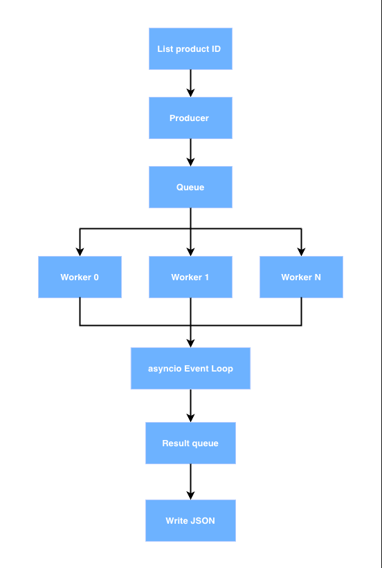

<div align="center" >
  <h1><strong>Tiki Product Data Engineering Pipeline</strong></h1>
</div>

## Overview 
This project is an async product crawler built with Python, asyncio and aiohttp. It is designed to: 
- Crawl detailed product information from Tiki API
- Handle request retry anti block
- Support checkpoint-based resume instead of restarting from the beginning
- Using Docker multi-worker architecture to improve crawling performance by parallelizing workloads
- ETL pipeline orchestration with Apache Airflow
- PostgreSQL for structured data storage
- Discord webhook for pipeline failure notifications

The diagram above illustrates the full processes: 
<p align="center">
  
</p>

## Input data
- Resource file: \
  A list of product IDs collected from Tiki, located in:
  ```
  resources/product_ids.csv
  ```
  After transforming & cleaning:
  ```
  resources/product_ids_clean.csv
  ```
- Product Detail API:
  ```
  https://api.tiki.vn/product-detail/api/v1/products/{product_id}
  ```
## Output data 
The crawler outputs product data in JSON format, with each file containing up to 1000 products.
Each product record includes the following fields:
- `id`
- `name`
- `url`
- `key`
- `price`
- `description`
- `images_url` 
  
Output location:
  ```
  data/raw/tiki_products/worker_{WORKER_ID}
  ```
## ETL Pipeline
1. Extract
   - Product IDs are read from a cleaned resource file
   - Each worker:
       - Processes a shard of the list product ID
       - Sends concurrent async requests to the detail product Tiki API
       - Handles retry, timeout, and anti-blocking logic
    - Crawled data is written as raw JSON files up to 1000 products per 1 file
    - Checkpoint is stored per worker to allow resume
2. Transform
   - Validate raw JSON schema
   - Remove duplicates
   - Normalize fields (price, url, images)
   - Handle missing records
3. Load
   - Cleaned data is loaded into PostgreSQL
   - Designed to support downstream analytics & BI use cases
## How to run project
1. Build Docker images
   ```
   docker-compose build --no-cache
   ```
2. Initialize Airflow metadata database
   ```
   docker-compose up -d airflow-init
   ```
3. Start all services
   ```
   docker-compose up -d 
   ```
## Environment variable
| Variable        | Description |
|-----------------|-------------|
| WORKER_ID       | Index of the current worker (default 0). Used for sharding product IDs. |
| TOTAL_WORKERS   | Total number of workers running in parallel. |
| CONCURRENT      | Number of concurrent async HTTP requests per worker. |
| BATCH_SIZE      | Maximum number of products per output JSON file. |
| RETRY           | Number of retry attempts for failed requests. |
| TIMEOUT         | Request timeout in seconds. |
| DATA_DIR        | Mounted data directory for output, logs, and checkpoints. |
| RESOURCE_FILE   | Input file containing product IDs. |
| DISCORD_WEBHOOK_URL   | Airflow failure notification |

## Conclusion
This project demonstrates an efficient async crawler using Python and Docker for scalable data crawling.

